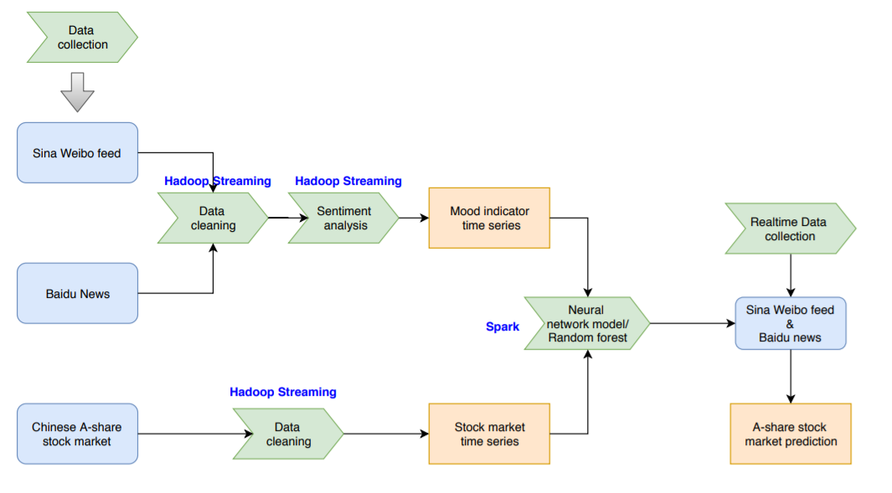
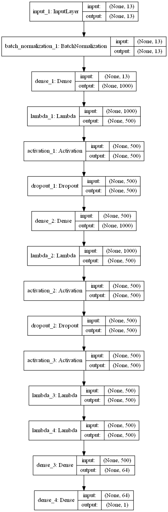
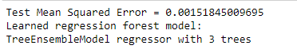

# Chinese Stock Prediction Using Weibo & Baidu News Sentiment 
    
This is a research project for NYU CSCI-GA.3033-003-Realtime-and-Big-Data-Analytics. A neural network regression model is trained to predict the mean stock price percentage change everyday using financial factors like previous close price, actual previous close price, open price,  market capitalization, total market value, price-to-earning ratio and price-to-book ratio, along with corresponding Sina Weibo and Baidu News sentiment scores. Additionally, a random forest model is also trained as a baseline model. Finally, the results are an RMSE of 0.002 and an RMSE of 0.0015 respectively which are similar. 

# Programe Design Diagram
Since this project is initiated as a big data management project so several big data tools are used here such as Hadoop Streaming, Spark and etc..
 

# Data
Since the lack of time, only 200 stocks were chosen to be our training set stock list. And the time period is from 2018-01-01 till now.
 1. Sentiment Scores   
 Sentiment analysis was performed on the tweets and news titles about the stocks of selected companies using [Baidu NLP API](https://cloud.baidu.com/doc/NLP/NLP-API.html) which can directly output a sentiment score of a text string.   
    
  1.1. Weibos   
  Sina Weibo is just like Twitter which has its own API. However, to crawl weibos back to more than one month ago can be too expensive. So a crawler is written here using Python to manually scrap stock-related weibos. P.S., a neural network classifier was trained to address the verification code but it didn't succeed so the codes should be inputed manually during crawling.   
  1.2. Baidu News   
  Just like Sina Weibo, a crawler is written here using Python.
 3. Stock Related Data   
 All dataset concerning financial factors and stock prices were downloaded from Uqer which is a quant backtesting platform in China.    
    
Finally, a training set of 4564 samples was obtained with predictors: stock id, trade date,sentiment score sum, number of social media, sentiment score mean,weighted sentiment score sum(sentiment score*confidence level), weighted sentiment score mean, previous close price, actual previous close price, open price,  market capitalization, total market value, price-to-earning ratio and price-to-book ratio.

# Neural Network Architecture
A typical neural network regressor architecture is established here.
 

# Result
For the random forest baseline model, a Root Mean Square Error(RMSE) of 0.0015 was obtained.   
    
Additionally, for the neural network, an RMSE of 0.002 was achieved.   
    
The two results were similar which can be due to the small size of the training set(4564 samples) because when the size of a training set is small, there can be few advantages of a neural network over a random forest.